# ICC-Ollama-Deployment Architekturübersicht

Diese Dokumentation beschreibt die Architektur des ICC-Ollama-Deployment-Projekts, das die Bereitstellung von Ollama mit GPU-Unterstützung auf der Informatik Compute Cloud (ICC) der HAW Hamburg ermöglicht.

## Architekturdiagramm

```mermaid
flowchart TD
    %% Akteure
    student[Student: Nutzt LLM für Textgenerierung]
    researcher[Forscher: Experimentiert mit verschiedenen Modellen]
    admin[Administrator: Verwaltet Deployments und GPU-Ressourcen]

    %% Haupteingangspunkte
    subgraph entry[Eingangspunkte]
        k8s_cli[kubectl CLI: Primäre Steuerung]
        make_cmd[Make: Vereinfachte Befehle]
        bash_scripts[Bash-Scripts: Automatisierte Workflows]
    end

    %% HAW-Infrastruktur
    subgraph haw_infra[HAW-Infrastruktur]
        vpn[HAW-VPN: Netzwerkzugang]
        icc_login[ICC-Login-Portal: Authentifizierung & Kubeconfig]
    end

    %% ICC Kubernetes Cluster
    subgraph k8s_cluster[ICC Kubernetes Cluster]
        subgraph namespace[Benutzer-Namespace w*-default]
            subgraph ollama_deploy[Ollama-Deployment]
                ollama_pod[Ollama-Pod: Führt Inferenz aus]
                ollama_svc[Ollama-Service: Interner Zugriff]
            end

            subgraph webui_deploy[WebUI-Deployment]
                webui_pod[WebUI-Pod: Benutzeroberfläche]
                webui_svc[WebUI-Service: Interner Zugriff]
            end

            subgraph gpu_resources[GPU-Ressourcen]
                gpu_toleration[GPU-Toleration: Ermöglicht Scheduling]
                gpu_tesla[NVIDIA Tesla V100: HW-Beschleunigung]
            end

            ingress[Optional: Ingress für externen Zugriff]
        end

        subgraph k8s_resources[K8s-Ressourcenmanagement]
            subns[Subnamespace-Verwaltung]
            rbac[RBAC: Zugriffssteuerung]
            scheduler[K8s-Scheduler: Pod-Platzierung]
        end
    end

    %% Lokale Entwicklungsumgebung
    subgraph local_dev[Lokale Entwicklungsumgebung]
        git_repo[Git Repository: icc-ollama-deployment]
        config[Konfigurationsdateien: config.sh]
        
        subgraph terraform_env[Terraform-Umgebung]
            tf_provider[Docker-Provider: Container-Management]
            tf_webui[WebUI-Container-Konfiguration]
            tf_output[Terraform Outputs: URLs]
        end
        
        port_forward[Port-Forwarding: Lokaler Zugriff]
    end

    %% Anwendungskomponenten
    subgraph components[Anwendungskomponenten]
        ollama_engine[Ollama Engine: LLM-Inferenz]
        ollama_api[Ollama API: REST-Schnittstelle]
        open_webui[Open WebUI: Benutzerfreundliche Oberfläche]
        llm_models[LLM-Modelle: llama3, phi3, mistral, etc.]
    end

    %% Beziehungen - Nutzer zu System
    student -->|Interagiert mit| open_webui
    researcher -->|Experimentiert mit| ollama_api
    admin -->|Verwaltet| k8s_cli

    %% Einrichtung und Zugang
    admin -->|Nutzt| bash_scripts
    admin -->|Vereinfachte Befehle| make_cmd
    bash_scripts -->|Automatisiert| k8s_cli
    admin -->|Verbindet über| vpn
    vpn -->|Ermöglicht Zugriff auf| icc_login
    icc_login -->|Generiert| config
    config -->|Konfiguriert| k8s_cli

    %% Deploymentprozesse
    k8s_cli -->|Erstellt| ollama_deploy
    k8s_cli -->|Erstellt| webui_deploy
    ollama_deploy -->|Nutzt| gpu_resources
    gpu_toleration -->|Erlaubt Scheduling auf| gpu_tesla
    ollama_pod -->|Hosted auf| gpu_tesla
    k8s_cli -->|Optional erstellt| ingress

    %% Komponenten-Beziehungen
    ollama_pod -->|Hostet| ollama_engine
    ollama_engine -->|Bietet| ollama_api
    ollama_engine -->|Lädt| llm_models
    webui_pod -->|Hostet| open_webui
    open_webui -->|Verbindet mit| ollama_svc

    %% Terraform-Workflow
    git_repo -->|Enthält| terraform_env
    tf_provider -->|Verwaltet| tf_webui
    tf_webui -->|Alternative zu| webui_deploy

    %% Zugriff auf Services
    k8s_cli -->|Ermöglicht| port_forward
    port_forward -->|Zugriff auf| ollama_svc
    port_forward -->|Zugriff auf| webui_svc
    ingress -->|Öffentlicher Zugriff auf| webui_svc

    %% Kubernetes Ressourcenverwaltung
    k8s_cluster -->|Verwaltet| namespace
    namespace -->|Teil von| subns
    rbac -->|Kontrolliert Zugriff auf| namespace
    scheduler -->|Platziert| ollama_pod
    scheduler -->|Platziert| webui_pod

    %% Lokale vs. ICC Entwicklung
    local_dev -->|Entwicklung und Tests| git_repo
    git_repo -->|Deployment auf| k8s_cluster
    terraform_env -->|Alternative Bereitstellung von| open_webui
```

## Hauptkomponenten

### Akteure
- **Studenten**: Nutzen LLMs für Textgenerierung über die WebUI
- **Forscher**: Experimentieren mit verschiedenen LLM-Modellen
- **Administratoren**: Verwalten Deployments und GPU-Ressourcen

### ICC Kubernetes Cluster
- **Namespace-basierte Isolation**: Jeder Benutzer erhält einen eigenen Namespace (w*-default)
- **Ollama-Deployment**: Führt die LLM-Inferenz auf GPU-Hardware aus
- **WebUI-Deployment**: Bietet eine benutzerfreundliche Oberfläche für die Interaktion
- **GPU-Ressourcen**: Tesla V100 GPUs mit entsprechenden Tolerationen für das Scheduling

### Lokale Entwicklungsumgebung
- **Git-Repository**: Enthält alle Konfigurationen und Skripte
- **Terraform-Umgebung**: Alternative Bereitstellungsmethode für die WebUI
- **Port-Forwarding**: Ermöglicht lokalen Zugriff auf die Services

### Anwendungskomponenten
- **Ollama Engine**: Führt die LLM-Inferenz aus
- **Open WebUI**: Benutzerfreundliche Oberfläche
- **LLM-Modelle**: Verschiedene Modelle wie llama3, phi3, mistral, etc.

## Bereitstellungswege

Das Diagramm zeigt zwei Hauptbereitstellungswege:

1. **Kubernetes-basierte Bereitstellung** (Hauptpfad):
   - Verwendet kubectl mit automatisierten Bash-Skripten
   - Deployt sowohl Ollama als auch WebUI im ICC Kubernetes Cluster
   - Nutzt GPU-Ressourcen für beschleunigte Inferenz

2. **Terraform-basierte Bereitstellung** (Alternative):
   - Lokale Bereitstellung der WebUI über Docker
   - Verbindung zu einem separaten Ollama-Server (lokal oder auf ICC)

## Zugriffsmethoden

- **Port-Forwarding**: Hauptzugriffsmethode für Entwicklung und Tests
- **Ingress**: Optional für öffentlichen Zugriff (mit TLS-Unterstützung)

## Zusammenfassung

Die Architektur bietet eine flexible und skalierbare Lösung für die Bereitstellung von LLM-Diensten mit GPU-Unterstützung in einer universitären Umgebung. Die Kombination aus automatisierten Skripten, Kubernetes-Ressourcen und alternativen Terraform-Konfigurationen ermöglicht verschiedene Einsatzszenarien für unterschiedliche Benutzergruppen.
